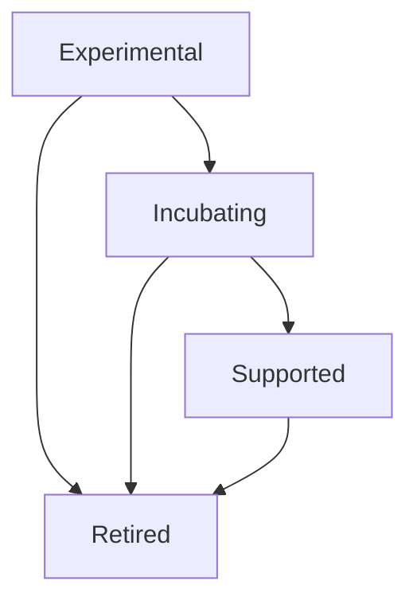

# MongoDB Open Source Project Lifecycle and Incubation Process

## Table of Contents

* [Overview](#overview)
* [Objectives](#objectives)
* [Project Stages](#project-stages)

  * [1. Experimental](#1-experimental)
  * [2. Incubating](#2-incubating)
  * [3. Supported](#3-supported)
  * [4. Retired](#4-retired)
* [Governance](#governance)
* [Communication and Labeling Guidelines](#communication-and-labeling-guidelines)
* [Project Promotion and Demotion Process](#project-promotion-and-demotion-process)
* [Repository Organization](#repository-organization)
* [Community Engagement](#community-engagement)
* [Roles & Responsibilities](#roles--responsibilities)
* [Appendix](#appendix)

  * [Similar Incubation Models](#similar-incubation-models)
  * [Tooling and Templates](#tooling-and-templates)

## Overview

This document defines the lifecycle and incubation process for open-source projects developed under the MongoDB ecosystem. It provides a structured framework that enables rapid innovation, clear communication of project maturity, community engagement, and alignment with MongoDB's strategic goals.

The lifecycle consists of four primary phases: Experimental, Incubating, Supported, and Retired. Each stage has clear entry and exit criteria and is supported by governance, documentation, and communication practices.

## Objectives

* Foster innovation and experimentation within MongoDB and the broader developer ecosystem
* Set transparent expectations regarding project supportability and maturity
* Encourage community engagement and reduce friction for external contributions
* Provide clear, consistent communication of project status
* Establish promotion and demotion criteria to ensure alignment with strategic goals

## Project Stages

### 1. Experimental

**Purpose:**
Projects in the Experimental phase are newly created, early-stage initiatives designed for rapid iteration and proof-of-concept exploration.

**Characteristics:**

* Maintainers are primarily internal contributors
* APIs and interfaces are unstable and may change frequently
* No long-term support guarantees
* Frequent changes and releases
* Suitable for early adopters and validation partners

**Entry Criteria:**

* Project has a defined problem statement and initial scope
* Project is created within the designated GitHub organization (e.g. `mongodb-incubator`)

**Exit Criteria (Promotion to Incubating):**

* Demonstrated interest or usage by external developers
* Initial API or feature stabilization
* Project has basic documentation and onboarding instructions

### 2. Incubating

**Purpose:**
Incubating projects are more stable than Experimental ones and open for wider community involvement. They are undergoing refinement and are evaluated for broader support.

**Characteristics:**

* Basic API stability (early SemVer practices encouraged)
* Encouraged community contributions
* Active roadmap with maintainers assigned
* GitHub Issues, Discussions, and CI established
* Still no guarantee of long-term support

**Entry Criteria:**

* Project shows signs of traction (stars, contributors, discussion, usage)
* APIs or UX are semi-stable and documented
* Governance practices are lightweight but defined

**Exit Criteria (Promotion to Supported):**

* Widespread adoption or customer interest
* Mature, stable API with release versioning
* Maintainers committed to support and long-term roadmap
* Approved by internal evaluation board (e.g. DX LT)

**Exit Criteria (Demotion or Retirement):**

* Project loses momentum or usage
* Strategic misalignment
* Maintainers no longer actively contributing

### 3. Supported

**Purpose:**
Projects in the Supported phase are production-ready and officially maintained by MongoDB.

**Characteristics:**

* Documented support policy (including release cadence and EOL strategy)
* Adheres to SemVer and backwards compatibility commitments
* Recommended for production use
* Go-to-market strategy and messaging coordinated with PMM

**Entry Criteria:**

* Passed maturity review
* Formal maintainer commitment (could include support SLAs for Enterprise)
* Documentation, tutorials, and diagnostics tooling provided

**Exit Criteria (Retirement):**

* Project becomes obsolete or replaced by better alternatives
* Decline in usage and contributor activity

### 4. Retired

**Purpose:**
Projects that are no longer maintained or have become obsolete.

**Characteristics:**

* Clearly marked as retired in README and project metadata
* Archived on GitHub
* Links to recommended alternatives, if applicable

**Entry Criteria:**

* Maintainers decide to deprecate project based on metrics or strategic evaluation
* Stakeholders notified

## Governance

Governance should remain lightweight until external contributors are introduced. For Incubating and Supported stages:

* Each project must document its governance model in the README or CONTRIBUTING.md
* Maintainers must be identified
* Decision-making and issue resolution processes must be clear
* External contributions should follow a Code of Conduct (e.g. MongoDB Community CoC)

## Communication and Labeling Guidelines

To avoid confusion, each project must:

* Display its status (Experimental, Incubating, Supported, Retired) via a README badge
* Include a standard disclaimer about the current level of support
* Use a reusable project README template
* Optionally use GitHub Labels (e.g. `status/experimental`, `status/supported`)

## Project Promotion and Demotion Process

Projects are evaluated regularly (quarterly or as-needed) against lifecycle criteria. The promotion/demotion decision is made by a small steering group composed of DX, PMM, and Engineering leads.

Promotion and demotion are based on:

* Usage and adoption metrics (downloads, GitHub stars, community activity)
* Stability and maturity of features
* Strategic alignment with MongoDB’s roadmap
* Maintainer bandwidth and interest

## Repository Organization

Projects will reside under a dedicated GitHub organization:

* Suggested name: `mongodb-incubator` or `mongodb-contrib`
* The org must clearly state its purpose in its README and org-level metadata
* Projects under this org are NOT guaranteed production support unless promoted

## Community Engagement

* Community contributions are welcomed starting in the Incubating stage
* Recognition mechanisms (like MongoDB Champions) should highlight key contributors
* DevRel to host spotlights, demos, and tutorials for promising projects

## Roles & Responsibilities

| Role          | Responsibilities                                                                |
| ------------- | ------------------------------------------------------------------------------- |
| DX            | Oversee incubation framework, set promotion criteria, run quarterly evaluations |
| PMM           | Define messaging and go-to-market strategy for Supported projects               |
| DevRel        | Promote incubating projects and engage developer community                      |
| Maintainer(s) | Drive project direction, triage issues, review PRs, ensure documentation        |

## Appendix

### Similar Incubation Models

* **Apache Incubator**: Emphasis on mentorship, IP transfer, open governance
* **CNCF Sandbox**: Focused on low-friction innovation and community building

### Tooling and Templates

* README templates with status badges
* Project scaffolding templates for Experimental/Incubating projects
* Label definitions for GitHub workflows
* Automation scripts for issue triage and archiving

---

By introducing this lifecycle framework, MongoDB can strike the right balance between innovation and operational discipline, ensuring open-source contributions are impactful, maintainable, and aligned with long-term strategy.
